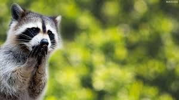
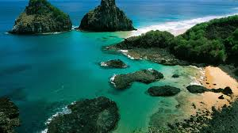
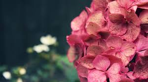

# PROCESAMIENTO GOBLAL EN OpenCV
## Estudiante
- Humpire Cutipa, Hayde Luzmila

## Requerimientos
```terminal
$ apt install python
$ pip install numpy
$ pip install opencv-python==4.1.2.30
```
## EJERCICIOS

### Ejercicio 1: Crear una transición entre dos imágenes A y B, que deben tener el mismo tamaño y número de canales.

- Entrada: Imagen A y Imagen B




- Compilación:

```terminal
hayde@haydehumpire:~/Documentos/TCG$ python Ej2_TransicionDosImagenes.py
```

- Salida:


### Ejercicio 2: Transformación gamma

### Ejercicio 3: Calcular el histograma unidimensional del nivel de gris de una imagen “a.jpg” en color. El resultado se escribe en salida debug.

- Entrada: 



- Compilación:

```terminal
hayde@haydehumpire:~/Documentos/TCG$ python Ej3_HistogramaUnidimensional.py
```

- Salida:


### Ejercicio 4: Calcular el histograma bidimensional de los canales (R,G) de una imagen “a.jpg” en color, con 64x64 celdas. El resultado se pinta en una imagen.

### Ejercicio 5: Aplicar una ecualización conjunta del histograma a una imagen “a.jpg” en color, usando calcHist y LUT.
